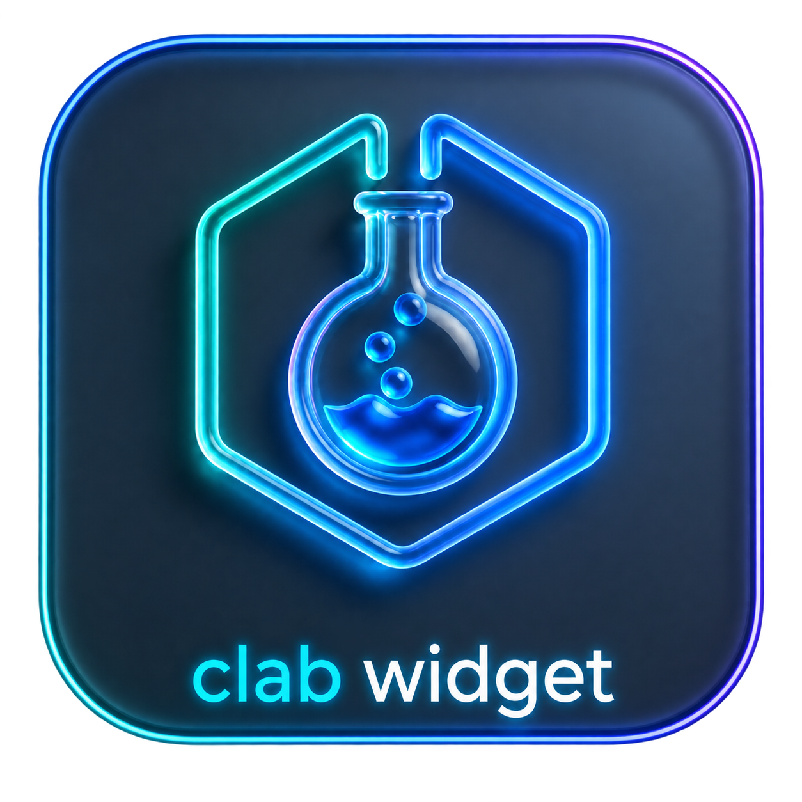
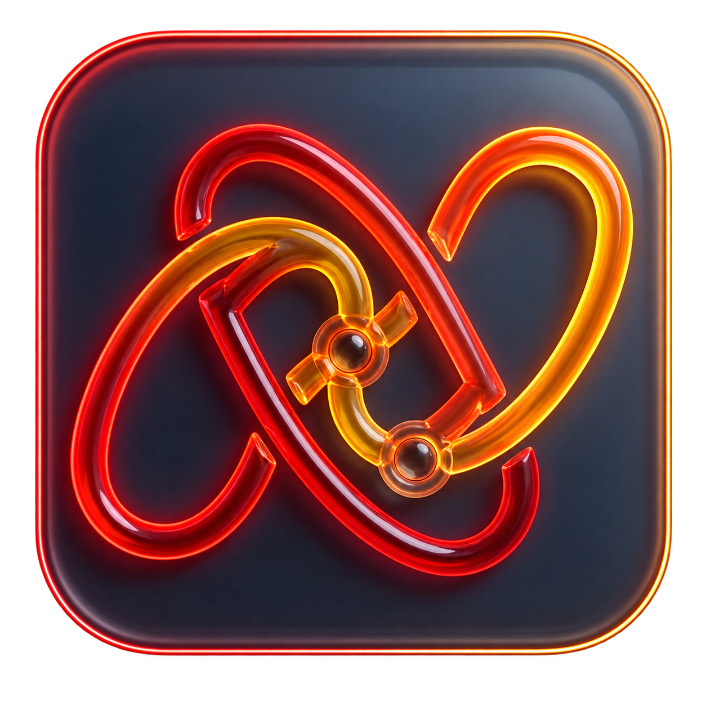
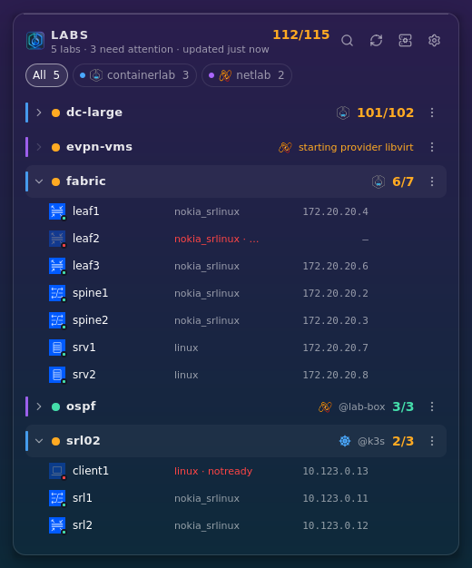
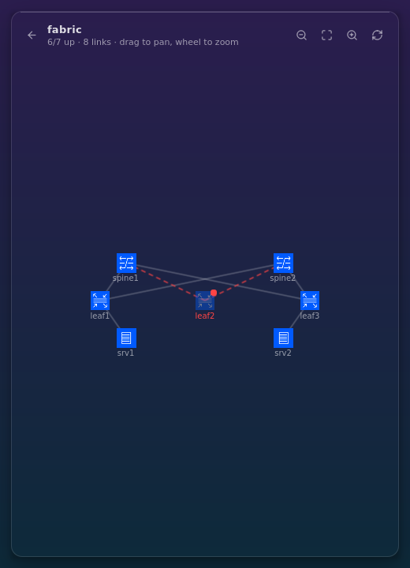
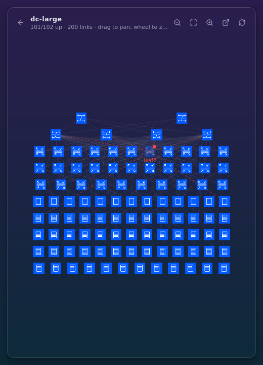
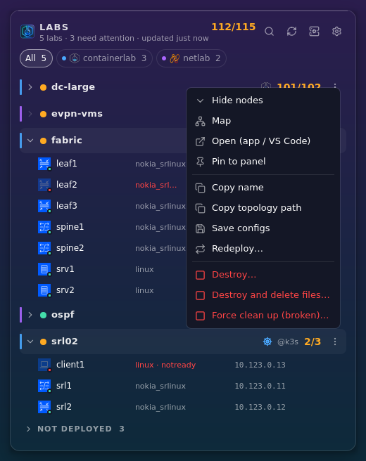
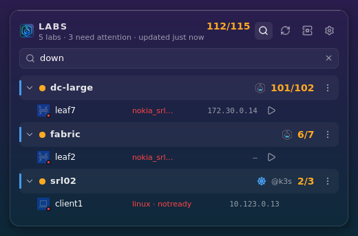
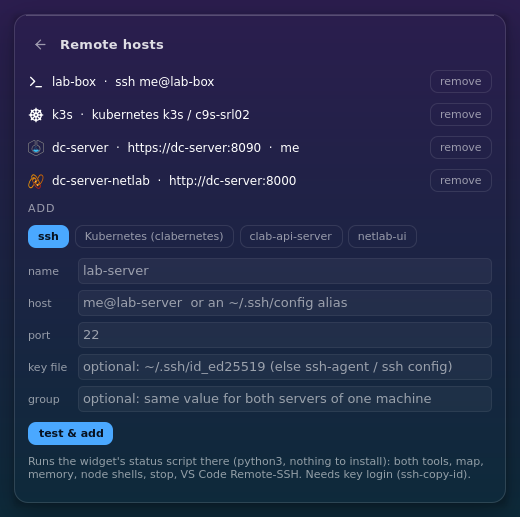
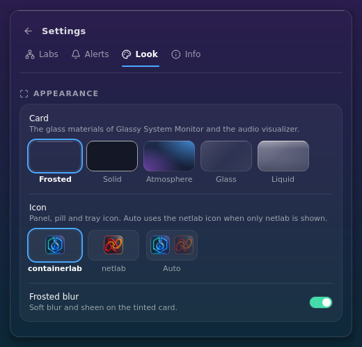

<p align="center">
  
  &nbsp;&nbsp;
  
</p>

<h1 align="center">CLAB Widget</h1>

<p align="center">
  <!-- <a href="https://github.com/Muddyblack/clab-widget/releases"> -->
    <!--  -->
  <!-- </a> -->
  
  
  <br/>
  <a href="LICENSE">
    
  </a>
  <a href="https://github.com/Muddyblack/clab-widget/releases">
    
  </a>
  
</p>

<p align="center">
  
</p>

**Containerlab & netlab lab status on your desktop:** which labs are running,
which nodes are down, how much memory they use, and one click back into the
containerlab app, netlab-ui, VS Code or a node shell. For the labs on this
machine, on as many lab servers as you like (ssh, WSL, clab-api-server,
netlab-ui), and on Kubernetes through clabernetes. It complements containerlab-app and netlab-ui rather than
replacing them.

> Community project. Not affiliated with srl-labs/Nokia (containerlab) or ipSpace (netlab).

## Screenshots

| Topology map | 102-node fabric |
| :---: | :---: |
|  |  |
| **Right-click a lab** | **Search: `down`** |
|  |  |
| **Remote hosts** | **Settings** |
|  |  |

The screenshots are rendered from the demo labs: `make screenshots`.

## Features

- **Every lab**: containerlab and netlab side by side. A netlab lab running on
  containerlab shows up once, as a "netlab · via clab" card. Show both, both as
  tabs, or only one.
- **Node health**: running / partial / stopped, per-node state and management
  IP, memory per lab and node (while the popup is open), uptime.
- **Topology map**, drawn from the JSON that clab-ui draws from:
  `topology-data.json` links, `graph-icon` roles, clab-ui's
  `.annotations.json` (icon, colour, position), and legacy
  `graph-posX/posY` labels. It uses clab-ui's own role icons. Pan, zoom,
  pinch and fit. Hover a node to highlight its links. Links are coloured
  like clab-ui while the popup is open: green up, dashed red down (read from
  each node's interfaces, no root needed); host / macvlan / mgmt-net ends
  show as small endpoints. Labs of 150+ nodes are
  drawn as tiles, so a 700-node fabric stays smooth.
- **One click back**: ssh (per-kind user) or `netlab connect`, docker shell
  (`sr_cli`…), logs, open in the containerlab app / netlab-ui / VS Code, like
  the containerlab VS Code extension does it.
- **Stop, carefully**: confirm, re-check that the lab is unchanged, then run it
  through its owner (`netlab down` / `containerlab destroy`) in a terminal.
- **Remote hosts**: ssh and WSL run the widget's own status script on the lab
  machine, so you get everything a local widget there would show. Also
  clab-api-server and netlab-ui servers. See [docs/remote-hosts.md](docs/remote-hosts.md).
- **Kubernetes (clabernetes)**: containerlab topologies on k8s / k3s / kind
  through [clabernetes](https://github.com/srl-labs/clabernetes). Node
  readiness, links and map, `kubectl exec` / logs, delete. Open jumps to the
  Topology in [Kubus](https://github.com/FloSch62/Kubus).
- **Notifications** (debounced over two polls): a node goes down or
  disappears, a tool or host becomes unreachable, and an opt-in reminder for
  labs left running (it never tears anything down).
- **Pin labs** to the panel item, the pill and the tray tooltip: `● fabric 6/7 · ● ospf 3/3`.
- **Glass look** from Glassy System Monitor: frosted, solid, atmosphere, glass,
  liquid. A containerlab or netlab app icon, or auto.

## Where it lives

| | |
| --- | --- |
| **KDE Plasma 6** | Desktop glass card, panel icon + popup, or the system tray |
| **Hyprland / Quickshell** | A pill in a corner with the popup, or a desktop card below your windows |
| **Windows / macOS** | Tray app with installer / dmg. Labs come from remote hosts (WSL2, ssh, API) |
| **GNOME & other Linux desktops** | The same tray app (`make install-desktop`); a normal window when there is no tray |

Install steps for each: [docs/installation.md](docs/installation.md).

## Using it

- Header: search (names, kinds, IPs, state; `down` = every node that isn't
  running), refresh, remote hosts, settings.
- Click a lab to show its nodes. Hover a row for quick actions.
  **Right-click** (or ⋮) for everything: map, open, pin, copy, stop.
- Nodes: hover for ssh / shell / logs, click the IP to copy it.
- Map: drag to pan, wheel or pinch to zoom, hover a node to highlight its
  links, click it for its menu. The ↗ button (or Settings → Labs → "Map in
  a window") opens it in its own resizable window.

## Quickshell IPC

With the Quickshell version running (`qs -p .` or `nix run .#view-hyprland`):

```bash
qs ipc -p /path/to/clab-widget call panel toggle          # open | close | refresh | settings | quit
qs ipc -p /path/to/clab-widget call panel setShow tabs    # both | tabs | containerlab | netlab
```

Hyprland: `bind = SUPER, L, exec, qs ipc -p /path/to/clab-widget call panel toggle`

## Development

```bash
direnv allow            # or: nix develop (ships containerlab + netlab)
make help               # every target
nix run .#view          # Plasma widget preview
nix run .#view-hyprland # Quickshell pill + popup
nix run .#desktop       # tray app (the Windows/macOS/GNOME frontend)
make run                # widget preview with demo labs, no Docker needed
eval "$(make -s demo)"  # demo labs for the other frontends
make test               # backend + schema (python) and shared QML logic (node)
make screenshots        # re-render docs/readme/*.png
```

The UI renders the backend's snapshot as-is. Its format is a JSON Schema:
[docs/snapshot.schema.json](docs/snapshot.schema.json). Contributing and
releases: [CONTRIBUTING.md](CONTRIBUTING.md). What's next: [TODO.md](TODO.md).

## Credits & license

GPL-3.0, see [LICENSE](LICENSE). Bundled third-party artwork keeps its
own license: Lucide icons (ISC, `package/contents/icons/ui/LICENSE-lucide.txt`),
the clab-ui node icons (generated from `SvgGenerator.ts`) and the containerlab
logo from [srl-labs/containerlab-app](https://github.com/srl-labs/containerlab-app)
(MIT), and the netlab-ui logo from
[Muddyblack/netlab-ui](https://github.com/Muddyblack/netlab-ui) (Apache-2.0).
The data files in `package/contents/upstream/` come from clab-ui and the
containerlab VS Code extension (Apache-2.0). Each set ships its license next to
it (`LICENSE-*.txt`), so they're in the `.plasmoid` too.
